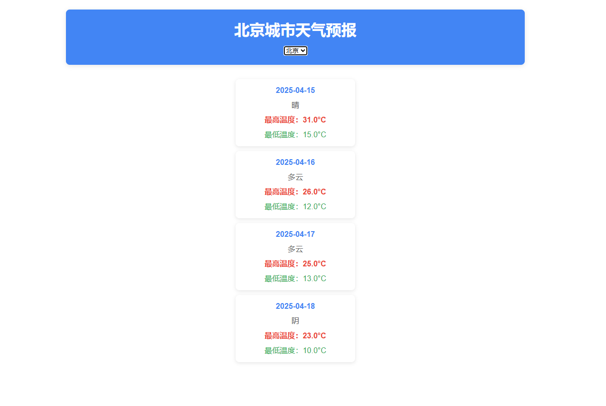

一个基于简单的天气查询app, 支持切换城市

访问地址：[点击访问](https://vercel.com/zzzzzjhhhhs-projects/weather-app/8jJDvmgxVRS737XrnRvP6f1aAv5J)


## Getting Started

First, run the development server:

```bash
npm run dev
# or
yarn dev
# or
pnpm dev
# or
bun dev
```

Open [http://localhost:3000](http://localhost:3000) with your browser to see the result.
